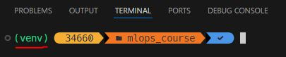
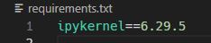

## Preparación entorno Python
Lo primero que se va a hacer es crear la carpeta del proyecto/curso, que en este caso se va a crear en la ruta _~\projects\\_ con nombre _mlops_course_.

Una vez creada la carpeta del proyecto, es nescesario situarse en ella para crear un entorno virtual de python, mediante la ejecución de:
```
~\AppData\Local\Programs\Python\Python310\python.exe -m venv .\venv
```
En esta parte lo que se está realizando es utilizar python3.10, donde se está llamando al modulo (es lo que siginifica el -m) de **venv** para generar un entorno virtual con nombre (venv) en la ruta del proyecto (que en este caso es en la que se está actualmente, por eso el .). Es decir, se va a generar un entorno virtual de Python 3.10 en la ruta del proyecto.

Una vez generado el entorno virtual, lo que se va a realizar es activarlo, para que en el caso se instale alguna librería sea sobre este entorno, y no se modifique cualquier otro pudiendo generar conflictos. Para ello se va a ejecutar:
```
.\venv\Scripts\activate
```

Para verificar que se ha activado correctamente, en la linea de comandos tendría que aparecer _(venv)_, tal como se muestra a continuación:



Llegados a esta pantalla ya se estaría preparado para generar un kernel apuntando a este entorno para cuando ejecutemos código en un notebook. Para crear el kernel, lo primero es instalar la librería **ipykernel**, para lo cual se ejecuta (una vez activado el entorno virtual) la siguiente sentencia:
```
pip install ipykernel
```
Una vez instalado, se observa la versión instalada (con el comando ``pip list`` para listar librerías instaladas en el entono virtual) y se genera el fichero requirements.txt donde se incluye la librería con su versión correspondiente para ir recogiendo las librerías que se han ido instalando:



Instalada la librería, se procede a crear el kernel, para lo cual se ejecutará:
```
python -m ipykernel install --user --name venv_mlops --display-name "venv (mlops course)"
```
Creado el kernel, lo siguiente sería generar la carpeta donde se van a ir creando los notebooks para experimentar, que en este caso se va a llamar _experiments_. Adicional, se instalará la librería de jupyter ejecutando (y guardando al versión en el requeriments.txt):
```
pip install jupyter
```

Instalada la librería, ya podemos levantar un notebook en el servidor local, mediante la ejecución de.
```
jupyter notebook
```

Donde automáticamente, se abrirá el navegador por defecto y aparecerá la siguiente pantalla:


En caso no se abriera automáticamente el navegador, simplemente sería copiar la _url_ que viene en la linea de comandos (```http://localhost:8888/tree```):


Entonces, se entraría en la carpeta que se generó para experimentar (_experiments_), y se generaría un notebook usando el kernel que se generó anteriormente ```venv (mlops course)``` poniendole el nombre de **00_introduccion_python**:


**Y ha empezar a programar!!!**

Para instalar el paquete que se está construyendo dentro de src en modo desarrollador, es necesario ejecutar:
```
pip install -e .[dev]
```