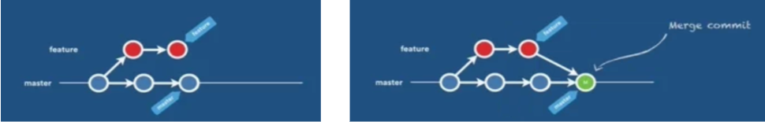
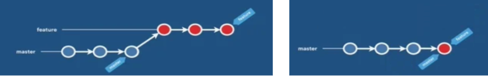
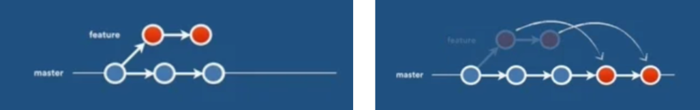
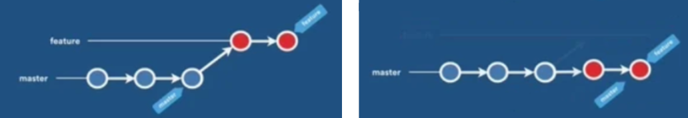

# Git

Es un sistema de control de versiones distribuido de código abierto que permite rastrear los cambios en los archivos a lo largo del tiempo, facilitando la colaboración entre desarrolladores y la gestión del ciclo de vida del software.

## Comandos

* Configuración a nivel global (si solo se quisiera para un proyecto en concreto usar local)

    
    ```
    git config --global <configuracion>
    ```

    En general las configuraciones que se principalmente son establecer nombre y correo para identificarse a la hora de hacer los commits

    ```
    git config --global user.name "<Nombre>"
    ```

    ```
    git config --global user.email "<correo electronico>"
    ```

    Como curiosidad, otra configuración de utilizadad es generar atajos para comandos que se suelan realizar a menudo y son largos de escribir, por ejemplo:

    ```
    git config --global alias.<atajo> "<comando>"
    ```

    Y luego simplemente basta con llamar al atajo:

    ```
    git <atajo>
    ```

    Ejemplos típicos:

    ```
    git config --global alias.s "status -s -b"
    ```

    ```
    git config --global alias.l "log --oneline --decorate --all --graph"
    ```


* Inicializar un repositorio
    
    ```
    git init
    ```

* Ver status del repositorio de git

    ```
    git status
    ```

* Añadir cambios al stage:
    
    * Único fichero
    
        ```
        git add <fichero>
        ```
    
    * Todos los cambios

        ```
        git add .
        ```

    Con el objetivo de evitar que git suba cambios de determinadas ubicaciones o ficheros, existe el fichero de _.gitignore_.

     * Por ejemplo, el entorno virtual (carpeta venv) es algo que no se necesita subir, por lo que se generaría un fichero [_.gitignore_](../.gitignore). en la raiz del proyecto y se le añadiría:
     ```
     venv/
     ```

* Realizar commit

    Permite realizar un commit que genera un registro de cambios en el repositorio, guardando una versión de este.
    
    ```
    git commit -m "<mensaje>"
    ```

    Si se quisiera dar una descripción más detallada, se podría llevar a cabo con el editor
    
    ```
    git commit -m "<mensaje>" --edit
    ```

    Las buenas prácticas recomiendan llevar a cabo commits cortos y descriptivos siguiendo el estandar de "Conventional Commits".
    
    * El estandar de "Convential Commits:
    
        ```
        <tipo>(<alcance>): <mensaje corto>

        <descripción opcional>
        ```

        Donde los tipos son:
      
        * **feat**: Nueva funcionalidad
      
        * **fix**: Corrección de errores
      
        * **chore**: Tareas de mantenimiento (sin afectar código)
      
        * **refactor**: Mejoras en el código sin cambiar funcionalidad
      
        * **perf**: Mejoras de rendimiento
      
        * **docs**: Documentación
      
        * **style**: Cambios en formato (espacios, comas, etc.)
      
        * **test**: Agregar/modificar pruebas
      
        * **ci**: Cambios en la configuración de integración continua
      
        * **build**: Cambios en el sistema de compilación o dependencias
      
        * **qrevert**: Deshacer un commit anterior

    Una herramienta util para llevar a cabo este estandar es "commitizen", el cual se instala ejecutando ```pip install commitizen```. Y en lugar de usar el commit con el git, usar:

    ```
    cz commit
    ```
        

    Para cambiar el mensaje del último commit, se puede utilizar

    ```
    git commit --amend
    ```

    Dentro de los commit, también hay una herramienta que ayuda a validar que los formatos de los commits son correctos, y que el código sigue las buenas práctias. Esta herramienta es pre-commits que se instala ejecutando ```pip install pre-commits```. Para indicar que se quiere validar antes de llevar a cabo el commit, se configura mediante hooks indicados en el fichero de configuración de [.pre-commits-config.yaml](./../.pre-commit-config.yaml) y las configuraciones de estos en el [pyproject.toml](./../pyproject.toml).

    * Mencionar que una vez obtenido _pre-commits_, es necesario instalarlo mediante ´´´pre-commit install --hook-type commit-msg´´´ donde la ultima parte es para que se validen los mensajes del commit antes de llevarlos a cabo.


* Eliminar commits (si se quiere eliminar los cambios que se hicieron en los commits que vienen despues de la versión a la que se regresa, existe el argumento --hard, el cual se recomienda utilizar como mucho cuidado).

    ```
    git reset HEAD~<n>
    ```

* Volver a una versión antigua, donde a nivel de git aparece como un nuevo commit este regreso de versión.

    ```
    git revert HEAD~<n>
    ```

* Guardar cambios para priorizar otra tarea

    ```
    git stash
    ```

    Listar los stash
    ```
    git stash list
    ```

    Restaurar modificaciones del stash y se borra.
    ```
    git stash pop
    ```

    Borrar stash (necesario cuando se resulven conflictos tras intentar ```git stash drop```).
    ```
    git stash drop
    ```

* Crear ramas

    ```
    git branch <rama>
    ```
    
    Listar todas las ramas (si solo se quieren locales poner -l y para solo remotas -r)
        
    ```
    git branch -a
    ```
    

    Renombrar rama

    ```
    git branch -m <nuevo nombre>
    ```

    Eliminar rama (que ha sido fusionada completamente)

    ```
    git branch -d <rama>
    ```
    
* Cambiar de rama o moverse a un commit determinado

    ```
    git checkout <rama o id_hash commit>
    ```
    
    * Si quiero crear la rama y cambiarme a esta nueva rama directamente, se
    
        ```
        git checkout -b <nueva rama>
        ```

* Merge de ramas

    Permite combinar cambios para fusionar ramas. Existen diferentes estrategias:
    * Merge Commit: Crea un commmit merge nuevo quedando la rama auxiliar.
        
    * Squash Merge: Poner el commit final de la rama auxiliar al final del commit de la rama principal y se borra la rama auxiliar  
        
    * Rebase and Merge: Establece un nuevo nivel base, es decir, todos los commits de la rama feature se ponen a continuación del ultimo commit de la rama principal, y se borra rama auxiliar.
        
    * Fast Forward: Se mueven todos los commits de la rama auxiliar a la rama principal (donde no es necesario hacer un rebase) donde no aparece commit de merge.
        
    
    Generalmente se mergea sobre la rama develop o master, por lo que primero hay que moverse a esa rama y luego se hace merge
    
    ```
    git merge <rama que quiero fusionar>
    ```

    Una forma de tener el código limpio y lineal es con el uso de rebase, que hace que si por ejemplo se han ido haciendo cambios en la rama develop mientras se desarrollaba una nueva funcionalidad en la feature, hace que el punto de partida en la rama feature cambie al último commit de la rama develop, por lo que para hacer el rebase se necesitaría estar en la rama feature:

    ```
    git rebase develop
    ```

    Para continuar con el rebase en caso haya conflicos, sería necesario llevar a cabo la resolución de los conflitos y luego:

    * Añadir cambios tras la resolución
        ```
        git add <fichero con conflito resuleto>
        ```

    * Continuar con el rebase
        ```
        git rebase --continue
        ```

    En caso se quiera abortar devolviéndote a la rama original sin cambios

    ```
    git rebase --abort
    ```

    Mencionar que existe un rebase interativo para modificar los commits anteirores, permitiendo cambiar mensajes, juntar commits, etc.

    ```
    git rebase -i HEAD~<n ultimos commits>
    ```

* Generar tags
    
    ```
    git tag <tag>
    ```

    Para generar tags anotados (con más información), existe el argumento "_-a_"

    * Con la herramienta de _commitizen_, también permite llevar un versionado automático tanto del proyecto como del package, configurándolo en el [pyproject.toml](./../pyproject.toml). Los comandos a utilizar serían:

        * Generar tag automático que actualiza la versión del package y del proyecto de manera automática en función de los commits que se ha llevado a cabo con el formato de "Conventional Commits"

        ```
        cz bump
        ```

        * Generar fichero de cambios "CHANGELOG.md" donde se exponen todos los commits con las respectivas versiones

        ```
        cz changelog
        ```

## Apendice instalar git (Windows)

[Tutorial instalar git](https://www.youtube.com/watch?v=3FTficFKzME&ab_channel=AComputerGuru)