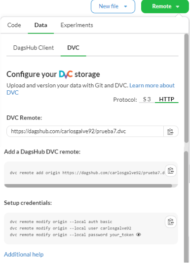

# DagsHub

Es una plataforma colaborativa para Data Science y Machine Learning, similar a GitHub, pero diseñada específicamente para el versionado de datos, modelos y experimentos. Está basada en herramientas como DVC (Data Version Control) y MLflow, lo que la hace ideal para MLOps.


## Configurar repositorio remoto para almacenar archivos

Generado el repositorio DVC, se necesita configurar el remoto apuntando a un repositorio remoto, en este caso de _DagsHub_, para lo cual será necesario configurarlo:

* Lo primero es añadir el repositorio remoto al repositorio local de DVC

```
dvc remote add origin https://dagshub.com/<nombre usuario en DagsHub>/<nombre repositorio remoto en DagsHub>.dvc
```
En este caso el nombre para identificar el repositorio local en local, se ha establecido como origin.

Y una vez añadido el repositorio remoto, simplemente quedaría confifurar las credenciales para autenticarse

```
dvc remote modify origin --local auth basic
dvc remote modify origin --local user <nombre usuario en DagsHub> 
dvc remote modify origin --local password <your_token>
```

Se puede ver el token en DagsHub, dentro del repositorio como se muestra en la siguiente imagen, dando al boton de copiar del final



## Apendice entrar DagsHub con credenciales de GitHub

Teniendo una cuenta de Github, el acceso a DagsHub es tan sencillo como entrar en su [plataforma]() y darle a _Log in_ en la parte superior izquierda. Y nos llevará a una pantalla donde simplemente es pinchar en el botón de _Continue with GitHub_ e introducir las credenciales de _GitHub_.

## Crear un nuevo repositorio conectándolo con uno existente en GitHub

Una vez entrado en _DagsHub_ con las credenciales de _GitHub_, simplemente se le da crear un nuevo repositorio y de las tres opciones que aparecen se selecciona la de _Connect a repository_ y después se selecciona la opción de GitHub, donde se le da permisos al repositorio que queremos seleccionar y se guarda. Tras esto, se seleccionaría el repositorio al que hemos permitido conectarnos desde DagsHub. 